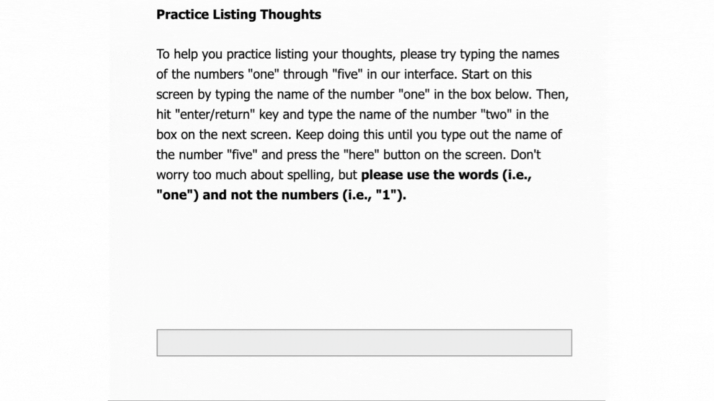
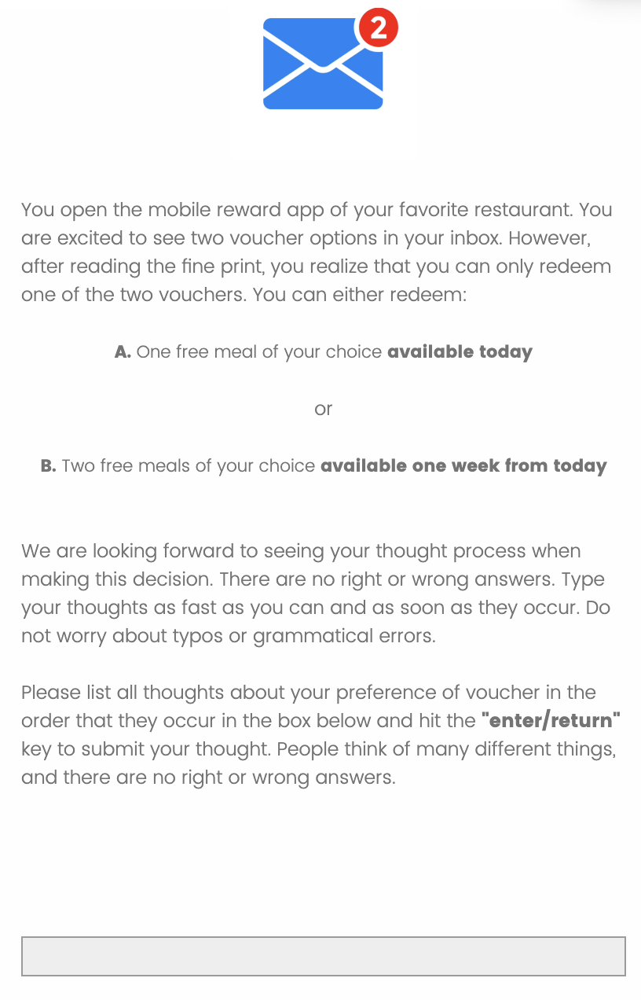
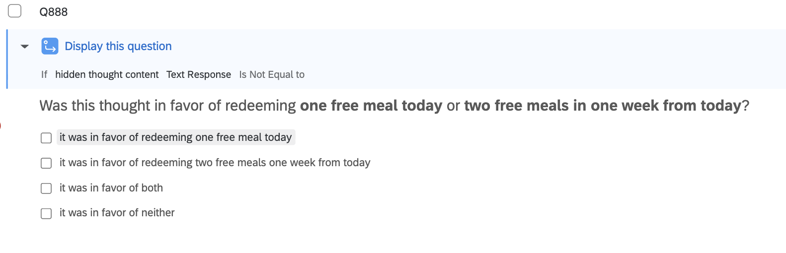
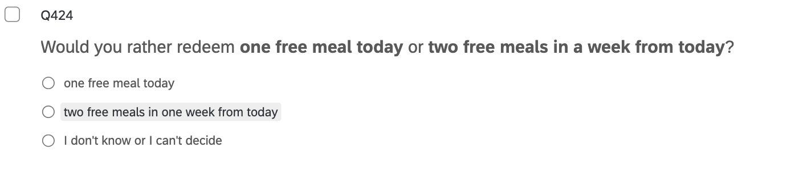
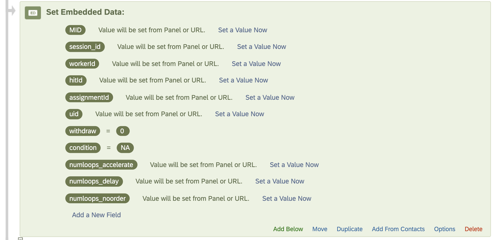
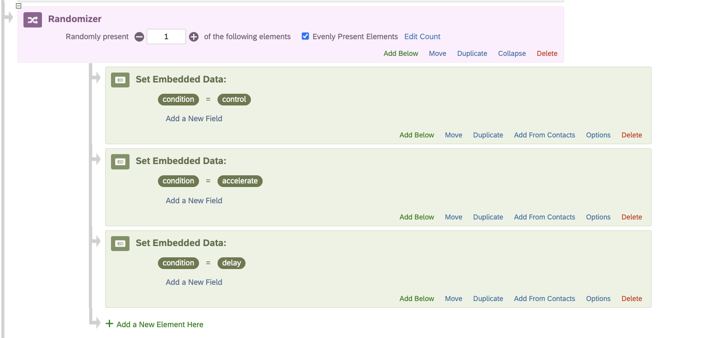
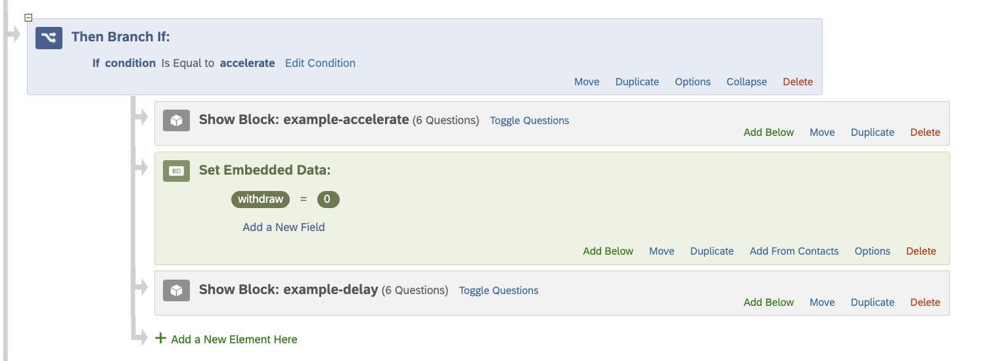
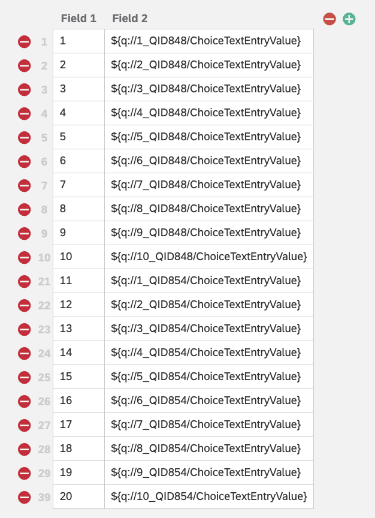
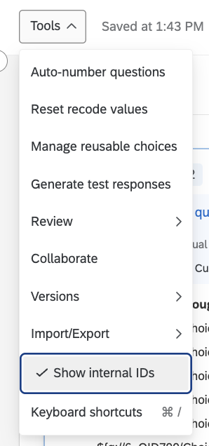
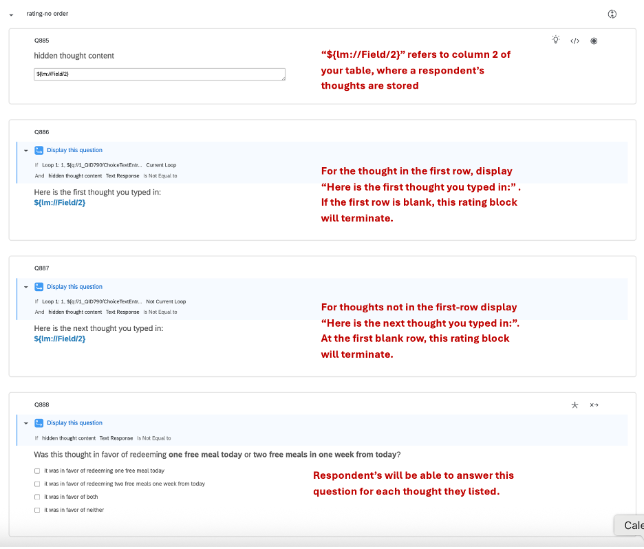

# Welcome to the QT demo

Thank you for your interest in Query Theory (hereby QT) and aspect
listing!

If you are unfamiliar, QT is a model of the cognitive processes
underlying decision-making. When a person is deciding among a set of
options, QT proposes that they are “querying” their memory in support of
or opposition to these options. Imagine, for example, that you are asked
whether you would prefer to receive a \$40 amazon gift card today, or
instead wait a week to receive a \$45 amazon gift card. Perhaps your
friend has been raving about a novel that you are excited to read as
soon as possible—a thought that you query in favor of receiving the \$40
amazon gift card today. Instead, you could imagine querying a thought in
favor of redeeming the \$45 gift card next week; Perhaps you do not have
any hot items on your wishlist and would like the additional \$5.

Thought-listing experimental paradigms, which we refer to as “aspect
listing”, allow researchers to probe a myriad of questions related to
QT. Simply put, aspect listing is a “think aloud” technique where
participants are asked to type their thoughts as they evaluate decision
options. Our Qualtrics survey setup saves these open-ended responses, so
that they are retrievable for further experimental questions. For
example, you may ask “On a scale of 1-7, how much does \[Thought J\]
support \[Option K\]” and so on.

The ability to save each respondent’s individual thoughts is powerful:
researchers can design questions to explore diverse aspects of
preference construction, or about the construction of different kinds of
preferences, making this tool especially versatile. In Weber’s QT paper
([2007](https://pubmed.ncbi.nlm.nih.gov/17576265/)), this technique
provided evidence that the option in which participants’ list support
for first is often the option they ultimately choose. Evidence has also
been provided to suggest that QT might explain the endowment effect—and
that simply instructing “sellers” and “choosers” to reverse their
natural order of listing thoughts can eliminate the endowment effect
([Johnson et al.
2017](https://psycnet.apa.org/record/2007-06096-001?casa_token=IPshV6sFLbwAAAAA:CBMrVKsH9gWgpUaSx4V6Ax9qiCoi5xPHi82tBYo8Id-hM_uWfeoNdKtI2-XxXSKynGqXHvt37crX5IJ3jeSEc0y7cA)).

The gif below demonstrates the aspect-listing interface. You can also
play around with this interface in the provided .qsf file:
Aspect_Listing_Demo.qsf.

  

  

  

Included in this GitHub repository are resources to help you implement
your own QT experiment. You may refer to this document as you set up
your Qualtrics and load and analyze your own data in R. We provide:

- A sample Qualtrics survey

- A Data-wrangling R analysis notebook

- This guide, which explains some useful know-hows of Qualtrics and the
  implementation of our aspect-listing procedure.

  
# Qualtrics

We provide a bare bone example of a QT aspect listing experiment built
in Qualtrics. This example is intentionally simplified and not optimized
for deployment. Its purpose is to illustrate how to implement our aspect
listing procedure, which involves a JavaScript insert and some (somewhat
tedious) configuration of Qualtrics’ survey flow and Loop & Merge
functionality. We hope these resources will be simple to follow, so that
you can jump into the world of QT with little hassle!

Our example includes two order-manipulation conditions—akin to listing
reasons to support a “smaller-sooner” option first and a “larger-later”
option second, or vice versa—and a no-order manipulation condition, i.e.
a control where respondents freely list all thoughts in support or
opposition of either option in any order.

Specifically, in our example, we tell respondents that they can choose
one of two vouchers: one free meal today or two free meals a week from
today, where the “one free meal today” voucher is the “smaller-sooner”
option and the “two free meals in one week” voucher is the
“larger-later” option. In our control condition, we simply ask
participants to list reasons to support or oppose either of the two
voucher options, in any order of their choosing:

  

  

  

Afterwards, in the Qualtrics block labelled “rating”, respondents are
presented with each thought that they listed one at a time and asked the
following:  

  

  

  
  
And finally, they are asked:
  

  

  

In our two other conditions, we ask participants to either (a) list reasons
to choose the one meal voucher that would be redeemed today first, or
(b) list reasons to choose the two meal vouchers that would be redeemed
in a week first. Following QT logic, the condition in which a
participant is assigned should influence their final voucher choice. For
example, we hypothesize that most of the participants in condition (a)
would choose the one meal today voucher. We recommend that you “preview”
the Qualtrics survey to get a better sense of its format.  
  
Below, we outline key details of the survey configuration to help you
adapt or expand the demo to your own project(s). Note that this guide
provides a high-level overview and doesn’t delve into the nitty-gritty
of all underlying survey logic. We recommend that when making your own
project, you copy this toy demo and try to replicate the skeleton of the
survey as closely as possible, while consulting [Qualtrics’
website](https://www.qualtrics.com/support/survey-platform/getting-started/survey-platform-overview/)
when you require more sophisticated detail about Qualtrics’ survey
builder than this guide offers.

  
# Instructions for Qualtrics Survey Configuration

 

## Import the. qsf survey file

First, import the QT_demo.qsf file into a new project in Qualtrics. For
step-by-step guidance, see:
<https://www.qualtrics.com/support/survey-platform/survey-module/survey-tools/import-and-export-surveys/>

 

## Overview of the Survey Structure

This survey demonstrates QT’s order effect in a simple “immediate vs.
delayed reward” task. Participants either

1.  List reasons for the smaller-sooner \[larger-later\] option first
    (order manipulation), or

2.  List all thoughts freely (no order manipulation)

Note: This is a “toy” example without full experimental considerations.

 

## Embedded Data Fields (Navigate to Survey Flow)

Setting up the proper embedded data fields is essential for a smoothly
running QT survey. Issues with generating QT surveys are most often due
to missing or incorrect data fields, or an incorrect loop-and-merge set
up (we will cover loop-and-merge set up in point 5).

 

 

For now, you can ignore all “id” variables. The id variables allow you
to capture unique participant IDs from whichever panel you collect data.

**Please** **note that if you edit any of these data fields or change
any of their names, you must update the JavaScript insert, which is
reliant on these embedded data fields.** **The survey will not function
properly otherwise.** The withdraw, numloops, and condition data fields
are essential for the following reasons:

1.  **withdraw:** This variable allows the experimenter to skip to a
    specific question or directly to the end of the survey if its value
    is set to 1. In our JavaScript, when a respondent hits the “here”
    button after they are finished listing their thoughts, the withdraw
    is set to 1, allowing the survey to proceed.

2.  **numloops\_\[accelerate \| delay \| noorder\]:** These variables
    record the number of “thoughts” or entries a respondent provides in
    each task block, i.e. when we ask participant to list their thoughts
    in support of one of the voucher options. For example, if a
    participant entered three thoughts in the accelerate-condition task
    block, the numloops_accelerate = 3. This value is set by the
    JavaScript insert attached to the click “here” to finish questions.

3.  **condition**: This variable allows the experimenter to randomly
    assign conditions to each respondent. It is set in the “Survey Flow”
    section of Qualtrics (and not in any of the JavaScript inserts). In
    this demo, there are three conditions:

    1.  Order manipulation conditions:

        1.  **accelerate:** Respondents first list reasons to redeem the
            two meals in a week voucher, then list reasons to redeem the
            one meal today voucher.

        2.  **delay:** Respondents first list reasons to redeem the one
            meal today voucher, and then list reasons to redeem the two
            meals in a week voucher

    2.  No order manipulation condition:

        1.  **control:** Respondents are free to list reasons for
            picking either of the two vouchers, in any order.

  

## Overview of Survey Flow

Now, you should navigate to Survey Flow.  
  
In this demo, the condition variable is assigned using a Qualtrics
**Randomizer** element in the Survey Flow. Each respondent is randomly
assigned to one of the three conditions.

 

  

 

After randomly assigning a condition to each respondent, you can order
blocks corresponding to each condition’s intended sequence. For example,
for the ‘accelerate’ condition, the “list larger-later” (list reasons to
redeem two meal vouchers in one week) block appears before the “list
smaller-sooner” (list reasons to redeem one meal voucher today) block.

 

  

 

We use the same type of condition-based survey logic to control which
rating block a respondent sees. Although the rating blocks may look the
same, each condition requires its own version. This is important because
we want the thoughts to appear in the exact same order in which a
respondent listed them. This will make more sense once we walk through
how the Loop & Merge feature works in both the aspect-listing and rating
blocks of our task.

These rating blocks get to the root of aspect-listing’s power: after a participant lists their thoughts, you can retrieve each thought one-at-a-time and ask follow-up questions about it 

  
# Loop-and-Merge

Aspect-listing relies on **Loop & Merge** functionality.  
  
The Loop & Merge feature in Qualtrics is what lets you retrieve each
thought a participant gave during the main aspect-listing task.
Specifically, Loop & Merge is doing two things:

1.  Saving each thought the participant typed (using something called
    piped text within Qualtrics)

2.  Showing those thoughts back to the participant later, one at a time.
    In our example, this enables respondents to rate whether each
    thought supported the one meal voucher today or the two meal
    vouchers in a week option.

You will need to add a Qualtrics Loop & Merge table to each
aspect-listing block and to each rating block. For the aspect-listing
blocks, these tables will be left blank. For the rating blocks, you will
need to set up your table accordingly. For example, in the Qualtrics
demo, for the delay rating block, the loop & merge table shows the
following:  

 

  

 

**Where:**

- QID848 = the **smaller–Sooner** thought-listing (“list reasons for
  **one meal today**”).

- QID854 = the **larger–Later** thought-listing (“list reasons for **two
  meals in one week**”).

Because respondents in the “delay” condition listed thoughts in support
of the smaller-sooner option first, we show them these thoughts first,
one at a time.

 

If your project has different question IDs, **replace the numeric part
of the QIDs** in the table with your survey’s IDs.

 
<table>
  <tr>
    <td width="260" valign="top">
      
    </td>
    <td valign="top">

<strong>Note:</strong> Within Qualtrics, editing the name of a question does <strong>not</strong> change its
QID, but duplicating, re-creating, or importing questions can assign <strong>new QIDs</strong>.
<strong>The QIDs might not be the same as the question name.</strong> To show the internal QIDs, navigate to the toolbar and select "Show internal IDs" (see the image to the left).

  </tr>
</table>

 

After setting up your Loop & Merge tables, you can reference a respondent’s thoughts one at a time in the rating block. If your table structure looks like ours, the thoughts will be stored in the second column of the table. You can reference them using the Qualtrics piped text `${lm://Field/2}`. 

 

 

  
# JavaScript Inserts

There are three essential JavaScript inserts included in the GitHub
Repo. The first two are a part of the main aspect-listing block. The
first records the thoughts typed by a respondent and the second
terminates the aspect-listing loop once a respondent hits the “here” to
finish button.

The third JavaScript insert simply hides the first question in the
rating block. This question is essential to load each thought listed in
the loop & merge table, allowing us to reference its default open-text
response “\${lm://Field/2}”. We do not want participants to see this
question because they would then be able to change the default response,
preventing the retrieval of the thoughts stored in the Loop & Merge
table.

Note that these inserts call on the surveys embedded data fields. It is
essential that if you change the name of an embedded data field, you
also change its name in these three JavaScript inserts.  
  
We will spare you the details of the JavaScript. The gif below shows
where these JavaScript inserts should be placed.

  

  

  

 

# Analysis (in R)

Along with the demo Qualtrics’ survey file, we provide a companion R
analysis notebook - ‘QT Aspect Listing Analysis Template.rmd’ . This
notebook focuses on loading-in the Qualtrics’ data titled ‘Aspect
Listing Demo_October 15, 2025_13.02.csv’ and performing some exploratory
analyses. We hope this will be a helpful starting point as you plan your
analyses for your own Query Theory related project.  
  
The R notebook should include some useful comments to help you
understand the code. Though the second chunk of code may be
intimidating, after getting through these tedious data-wrangling steps,
analysis should be somewhat straightforward. We provide some sample
analysis code chunks of some of the most common QT analysis techniques.
Specifically, we probe the “proportion of impatient thoughts” per
condition, and the standardized median rank difference, described by
Weber (2007) as

> “SMRD = 2(MRp - MRi)/n, where MRp is the median rank of
> patient thoughts, MRi is the median rank of impatient
> thoughts, and n is the total number of thoughts (Johnson et al., in
> press). Randomly interspersed thoughts produce an SMRD of zero”.

One important thing to note is that the data-wrangling part of the code
relies on the unintuitive QIDs provided by Qualtrics. You will need to
update these QIDs to match your own survey.

 

# References

Weber, E. U., Johnson, E. J., Milch, K. F., Chang, H., Brodscholl, J. C., & Goldstein, D. G. (2007). Asymmetric discounting in intertemporal 
&nbsp;&nbsp;&nbsp;&nbsp;&nbsp;&nbsp;&nbsp;choice: A query-theory account. *Psychological science*, *18*(6), 516-523.

Johnson, E. J., Häubl, G., & Keinan, A. (2007). Aspects of endowment: a query theory of value construction. *Journal of experimental 
&nbsp;&nbsp;&nbsp;&nbsp;&nbsp;&nbsp;&nbsp;psychology: Learning, memory, and cognition*, *33*(3), 461.
